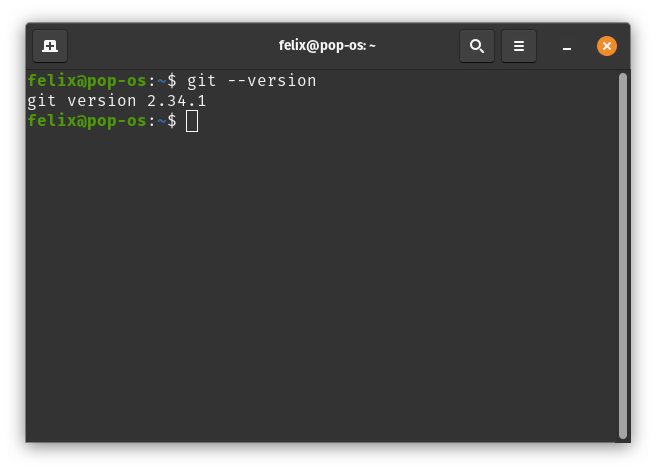

## Check if git is installed
In your terminal put in the following command
```bash
git --version
```

If the terminal ouputs:
```bash
git version <version_number>
```


Then Git is already installed on your machine. Else input the following command to install Git:

Debian/Ubuntu
```bash
sudo apt install git
```

RHEL/Fedora
```bash
sudo dnf install git
```
## Git Profile set up
Configure your Git username and email
```bash
git config --global user.name "Firstname Lastname"
git config --global user.email "your_email@youremail.com"
```